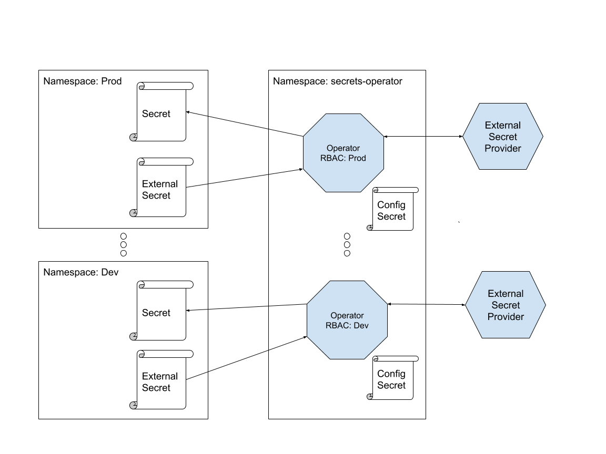

# External Secret Operator

[](https://goreportcard.com/report/github.com/ContainerSolutions/externalsecret-operator) [](https://codecov.io/gh/ContainerSolutions/externalsecret-operator)

This operator reads information from a third party service
like [AWS Secrets Manager](https://aws.amazon.com/secrets-manager/) or [AWS SSM](https://docs.aws.amazon.com/systems-manager/latest/userguide/systems-manager-paramstore.html) and automatically injects the values as [Kubernetes Secrets](https://kubernetes.io/docs/concepts/configuration/secret/).

# Table of Contents

* [Quick start](#quick-start) 
* [Kustomize](#kustomize)
* [What does it do?](#what-does-it-do)
* [Architecture](#architecture)
* [Spec](#spec)
* [Supported Backends](#secrets-backends)
  * [1-Password](#1password)
    * [Prerequisites](#1password-pre)
    * [Deployment](#1password-deployment)
  * [GCP Secret Manager](#google-secret-manager)
    * [Prerequisites](#google-secret-manager-pre)
    * [Deployment](#google-secret-manager-deployment)
* [Contributing](#contributing)


<a name="quick-start"></a>

## Quick start

<!-- If you want to jump right into action you can deploy the External Secrets Operator using the provided [helm chart](./deployments/helm/externalsecret-operator/README.md) or [manifests](./deploy). The following examples are specific to the AWS Secret Manager backend. -->

<!-- <a name="helm"></a> -->

<!-- ## Helm

Here's how you can deploy the External Secret Operator in the `default`.

```shell
export AWS_ACCESS_KEY_ID="AKIAYOURSECRETKEYID"
export AWS_DEFAULT_REGION="eu-west-1"
export AWS_SECRET_ACCESS_KEY="OoXie5Mai6Qu3fakemeezoo4ahfoo6IHahch0rai"
helm upgrade --install asm1 --wait \
    --set operatorName="asm-example" \
    --set secret.data.Type="asm" \
    --set secret.data.Parameters.accessKeyID="$AWS_ACCESS_KEY_ID" \
    --set secret.data.Parameters.region="$AWS_DEFAULT_REGION" \
    --set secret.data.Parameters.secretAccessKey="$AWS_SECRET_ACCESS_KEY" \
    ./deployments/helm/externalsecret-operator/.
```

It will watch for `ExternalSecrets` with `Backend: asm-example` resources in the `default` namespace and it will inject a corresponding `Secret` with the value retrieved from AWS Secret Manager.
-->

<a name="kustomize"></a>

## Using Kustomize 
#### Install the operator CRDs

- Install CRDs

```
make install
```

<a name="#what-does-it-do"></a>

## What does it do?

Given a secret defined in AWS Secrets Manager:

```shell
% aws secretsmanager create-secret \
  --name=example-externalsecret-key \
  --secret-string='this string is a secret'
```

and updated aws credentials to be used in `config/credentials/kustomization.yaml` with valid AWS credentials:

```yaml
%cat config/credentials/kustomization.yaml
resources:
# - credentials-gsm.yaml
- credentials-asm.yaml
# - credentials-dummy.yaml
# - credentials-onepassword.yaml
```

```yaml
%cat config/credentials/credentials-asm.yaml
...
credentials.json: |-
    {
      "accessKeyID": "AKIA...",
      "secretAccessKey": "cmFuZG9tS2VZb25Eb2Nz...",
      "sessionToken": "" 
    }
```

and an `SecretStore` resource definition like this one:

```yaml
% cat config/samples/store_v1alpha1_secretstore.yaml
apiVersion: store.externalsecret-operator.container-solutions.com/v1alpha1
kind: SecretStore
metadata:
  name: secretstore-sample
spec:
  controller: staging
  store:
    type: asm
    auth: 
      secretRef: 
        name: externalsecret-operator-credentials-asm
    parameters:
      region: eu-west-2
```

and an `ExternalSecret` resource definition like this one:

```yaml
% cat config/samples/secrets_v1alpha1_externalsecret.yaml
apiVersion: secrets.externalsecret-operator.container-solutions.com/v1alpha1
kind: ExternalSecret
metadata:
  name: externalsecret-sample
spec:
  storeRef: 
    name: externalsecret-operator-secretstore-sample
  data:
    - key: example-externalsecret-key
      version: latest
```

The operator fetches the secret from AWS Secrets Manager and injects it as a
secret:

```shell
% make install
% make deploy
% kubectl get secret externalsecret-operator-externalsecret-sample -n externalsecret-operator-system \
  -o jsonpath='{.data.example-externalsecret-key}' | base64 -d
this string is a secret
```
<a name="architecture"></a>

## Architecture

In [this article](https://docs.google.com/document/d/1hA6eM0TbRYcsDybiHU4kFYIqkEmDFo5GWNzJ2N398cI) you can find more information about the architecture and design choices. 

Here's a high-level diagram of how things are put together.



<a name="spec"></a>

## CRDs Spec

- See the CRD spec
  - [ExternalSecret](./docs/spec/ExternalSecret.md)
  - [SecretStore](./docs/spec/SecretStore.md)

<a name="secrets-backends"></a>

## Supported Backends

We would like to support as many backends as possible and it should be rather easy to write new ones. Currently supported or planned backends are:

* [AWS Secrets Manager](https://aws.amazon.com/secrets-manager/)
* [1Password](https://1password.com/security/)
* [Keybase](https://keybase.io/)
* [Git-secret](https://git-secret.io/)
* [GCP Secret Manager](https://cloud.google.com/secret-manager)

<!-- A contributing guide is coming soon! -->

<a name="1password"></a>

### 1Password [REVIEWING]

<a name="1password-pre"></a>

#### Prerequisites

* An existing 1Password team account.
* A 1Password account specifically for the operator. Tip: Setup an email with the `+` convention: `john.doe+operator@example.org`
* Store the _secret key_, _master password_, _email_ and _url_ of the _operator_ account in your existing 1Password account. This screenshot shows which fields should be used to store this information.
* Our naming convention for the item account is 'External Secret Operator' concatenated with name of the Kubernetes cluster for instance 'External Secret Operator minikube'. This item name is also used for development.
  
- Install CRDs 
```
  make install
```

<a name="1password-deployment"></a>

#### Deployment

- Uncomment and update credentials to be used in `config/credentials/kustomization.yaml`:

```yaml
resources:
# - credentials-gsm.yaml
# - credentials-asm.yaml
# - credentials-dummy.yaml
- credentials-onepassword.yaml
```

- Update the onepassword credentials `config/credentials/credentials-onepassword.yaml` with valid  `secretKey` and `masterPassword`

```yaml
%cat config/credentials/credentials-onepassword.yaml
...
credentials.json: |-
    {
      "secretKey": "${OP_SECRET_KEY}",
      "masterPassword": "${OP_MASTER_PASSWORD}"
    }

```
-  Update the `SecretStore` resource definition `config/samples/store_v1alpha1_secretstore.yaml`
```yaml
% cat  `config/samples/store_v1alpha1_secretstore.yaml
apiVersion: store.externalsecret-operator.container-solutions.com/v1alpha1
kind: SecretStore
metadata:
  name: secretstore-sample
spec:
  controller: staging
  store:
    type: onepassword
    auth: 
      secretRef: 
        name: externalsecret-operator-credentials-onepassword
    parameters:
      vault: Personal
      email: email@email-provider.com
      domain: domain.onepassword.com

```

-  Update the `ExternalSecret` resource definition `config/samples/secrets_v1alpha1_externalsecret.yaml`
```yaml
% cat config/samples/secrets_v1alpha1_externalsecret.yaml
apiVersion: secrets.externalsecret-operator.container-solutions.com/v1alpha1
kind: ExternalSecret
metadata:
  name: externalsecret-sample
spec:
  storeRef: 
    name: externalsecret-operator-secretstore-sample
  data:
    - key: example-externalsecret-key
      version: latest
```

- The operator fetches the secret from 1password and injects it as a
secret:

```shell
% make deploy
% kubectl get secret externalsecret-operator-externalsecret-sample -n externalsecret-operator-system \
  -o jsonpath='{.data.example-externalsecret-key}' | base64 -d
```

<a name="google-secret-manager"></a>

## GCP Secret Manager

<a name="google-secret-manager-pre"></a>

#### Prerequisites
- Enabled and configured secret manager API on your GCP project. [Secret Manager Docs](https://cloud.google.com/secret-manager/docs/configuring-secret-manager)

- Install CRDs 
```
  make install
```

<a name="google-secret-manager-deployment"></a>

#### Deployment

- Uncomment and update credentials to be used in `config/credentials/kustomization.yaml`:

```yaml
resources:
- credentials-gsm.yaml
# - credentials-asm.yaml
# - credentials-dummy.yaml
# - credentials-onepassword.yaml
```

- Update the gsm credentials `config/credentials/credentials-gsm.yaml` with service account key JSON

```yaml
%cat config/credentials/credentials-gsm.yaml
...
credentials.json: |-
    {
      "type": "service_account"
      ....
    }

```
-  Update the `SecretStore` resource definition `config/samples/store_v1alpha1_secretstore.yaml`
```yaml
% cat  `config/samples/store_v1alpha1_secretstore.yaml
apiVersion: store.externalsecret-operator.container-solutions.com/v1alpha1
kind: SecretStore
metadata:
  name: secretstore-sample
spec:
  controller: staging
  store:
    type: gsm
    auth: 
      secretRef: 
        name: externalsecret-operator-credentials-gsm
    parameters:
      projectID: external-secrets-operator
```

-  Update the `ExternalSecret` resource definition `config/samples/secrets_v1alpha1_externalsecret.yaml`
```yaml
% cat config/samples/secrets_v1alpha1_externalsecret.yaml
apiVersion: secrets.externalsecret-operator.container-solutions.com/v1alpha1
kind: ExternalSecret
metadata:
  name: externalsecret-sample
spec:
  storeRef: 
    name: externalsecret-operator-secretstore-sample
  data:
    - key: example-externalsecret-key
      version: latest
```

- The operator fetches the secret from GCP Secret Manager and injects it as a
secret:

```shell
% make install
% make deploy
% kubectl get secret externalsecret-operator-externalsecret-sample -n externalsecret-operator-system \
  -o jsonpath='{.data.example-externalsecret-key}' | base64 -d
```
<a name="contributing"></a>

## Contributing

Yay! We welcome and encourage contributions to this project! 

See our [contributing document](./CONTRIBUTING.md) and
[Issues](https://github.com/ContainerSolutions/externalsecret-operator/issues) for
planned improvements and additions.
